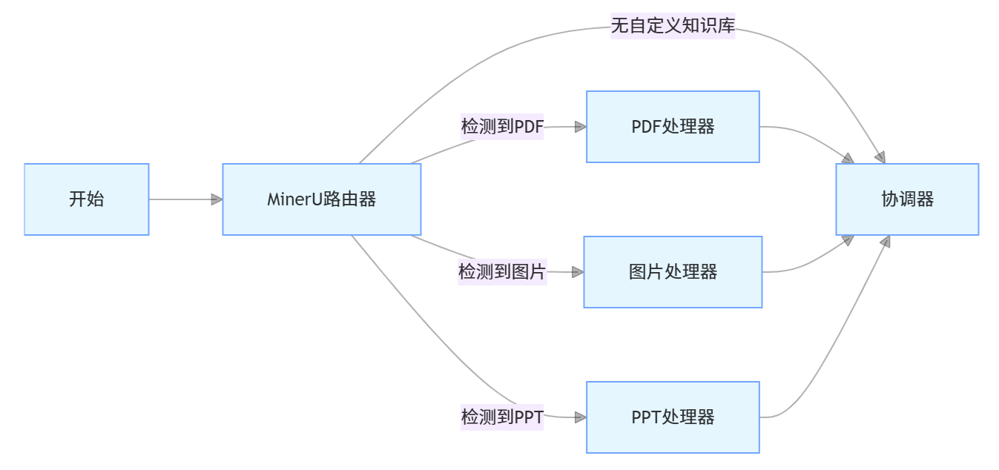
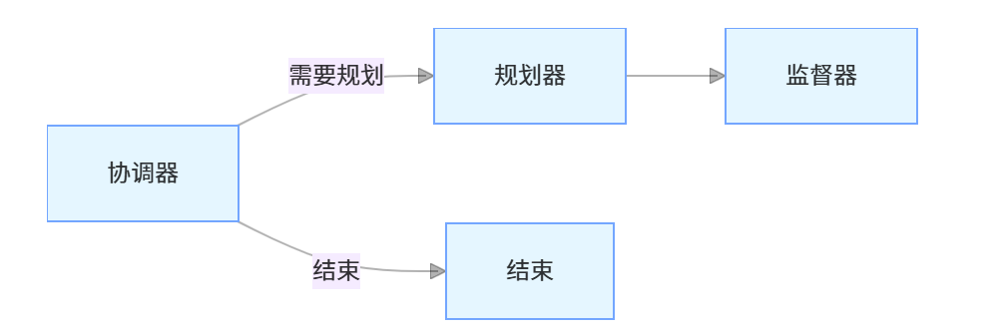
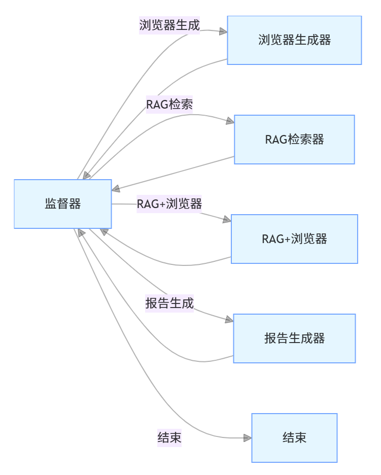
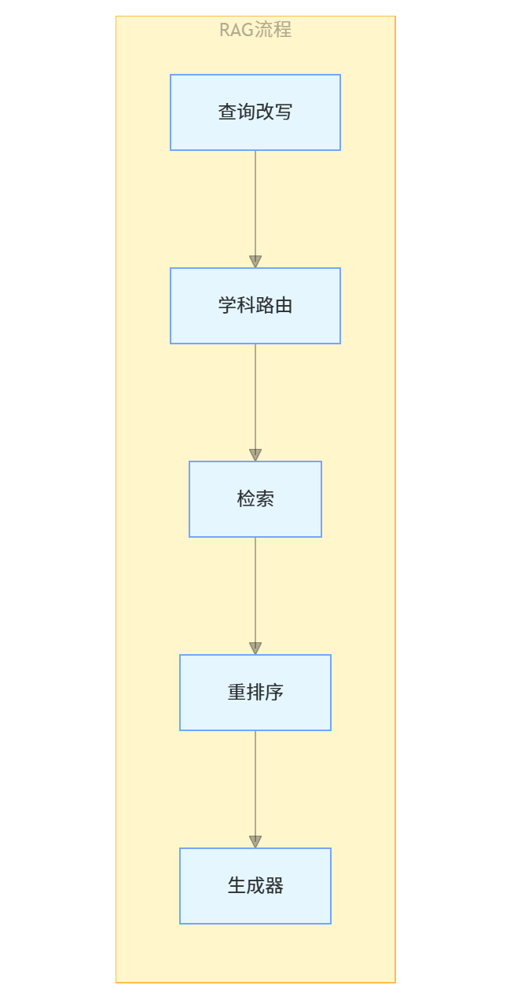

# Nodes 模块

## 简介
Nodes模块是Quizmanus系统的核心组件之一，包含了系统中各种节点（Nodes）的实现。这些节点是基于Langgraph构建的状态图（StateGraph）中的基本执行单元，负责处理不同类型的任务和状态转换。

## 文件结构
nodes/
├── nodes.py           # 主要节点实现，包含coordinator、planner、supervisor等核心节点
├── rag_nodes.py       # RAG相关节点实现，包含检索、重排序和生成等功能
├── quiz_types.py      # 定义了系统中使用的各种类型和状态结构
└── miner_nodes.py     # MinerU相关节点实现，用于处理PDF、图片和PPT等资源

## 系统流程图









## 主要节点说明

### nodes.py
包含系统的主要节点实现：
- `main_coordinator`: 协调者节点，负责与用户交流并决定是否需要进一步规划
- `main_planner`: 计划者节点，对复杂任务进行拆解
- `main_supervisor`: 监督者节点，监督其他节点的执行并决定下一步行动
- `main_browser_generator`: 浏览器生成器节点，执行网络浏览任务
- `main_reporter`: 报告节点，整合生成的题目并完善试卷
- `main_rag`: RAG节点，使用检索增强生成技术生成题目
- `main_rag_browser`: 基于RAG的浏览器节点，结合检索和网络搜索生成题目

### rag_nodes.py
包含与检索增强生成（RAG）相关的节点：
- `rag_hyde`: 实现HyDE（Hypothetical Document Embeddings）技术，改写查询以提高检索效果
- `rag_router`: 路由节点，选择合适的学科和题型
- `rag_retrieve`: 检索节点，从向量库中检索相关文档
- `rag_reranker`: 重排序节点，使用bge-reranker-v2-m3对检索结果进行重排
- `rag_generator`: 生成节点，基于检索结果生成题目

### quiz_types.py
定义了系统中使用的各种类型和状态结构：
- `RAGState`: RAG状态类，包含检索、重排序等相关状态
- `State`: 系统状态类，继承自MessagesState，包含运行时变量和配置

### miner_nodes.py
包含MinerU相关的节点实现：
- `miner_router`: 路由节点，判断输入类型并选择合适的处理器
- `pdf_processor`: PDF处理节点，处理PDF文件
- `image_processor`: 图片处理节点，处理图片文件
- `ppt_processor`: PPT处理节点，处理PPT文件

## 使用方式
这些节点通过`src/graph/builder.py`中的`build_main()`和`build_rag()`函数组装成完整的状态图，形成系统的工作流程。节点之间通过状态传递和命令（Command）进行通信和控制流转换。

## 开发指南
开发新节点时，需要遵循以下模式：
1. 节点函数接收一个`State`参数
2. 节点函数返回一个`Command`对象，包含状态更新和下一步去向
3. 在`builder.py`中注册新节点并添加相应的边

示例：
```python
def new_node(state: State):
    # 处理逻辑
    return Command(
        update={
            "key": "value"  # 状态更新
        },
        goto="next_node"  # 下一步去向
    )
